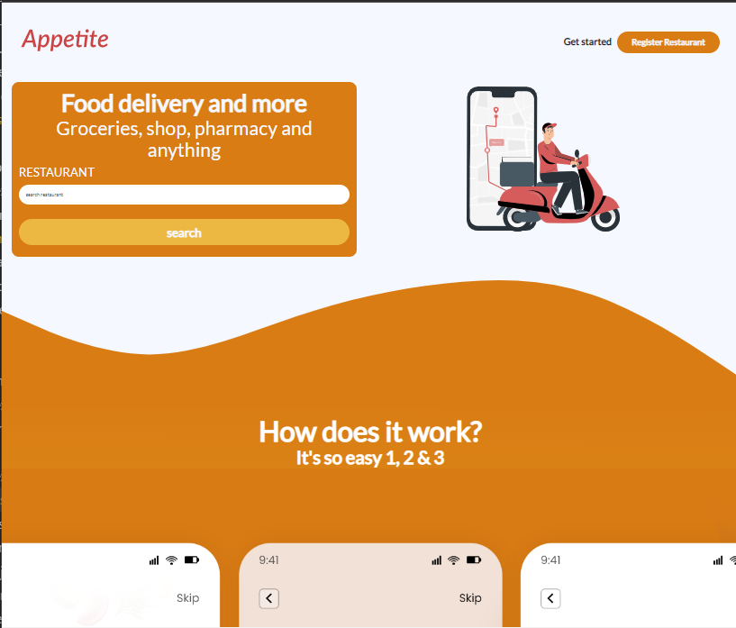
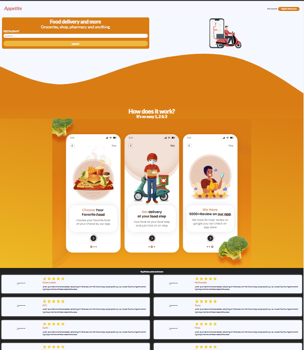
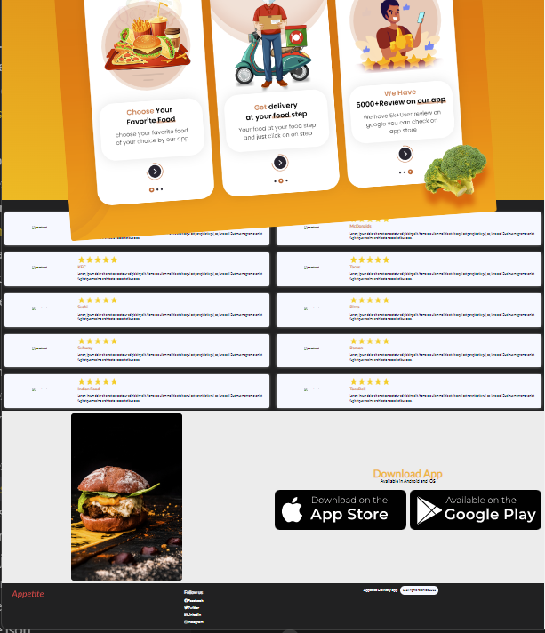

# APPETITE DELIVERY LANDING PAGE UI

# WMAD Cornerstone program Web Dev 1 Final Project
Creating a landing page with HTML5, SASS, CSS Grid and Flexbox.

## Instructions:
1. Make an HTML and SASS landing page of any type of imaginary business. It could
be a product promotion, product detail, company website.
2. Only use SASS for your CSS infrastructure.
3. Responsive: mobile, tablet and desktop friendly design.
4. Deploy by:

## App Evolution

- Index
  

- Landing Page Design
  

  - Landing Page Design
  

## To run this project

1. Clone repo
Clone the repository [here]( https://github.com/chicacode/appetite-delivery-app.git) to go to my Github repository.

2. NPM Install
- npm i

3. Run App
- gulp dev

### Technologies used

1. HTML
2. CSS
3. SASS
4. Font Awesome
5. Google Fonts
6. GULP (Automate tasks)

# Developed by:
Geri

### References:

1. Glovo App
2. Images from Unsplash, Dribbble and Google Images